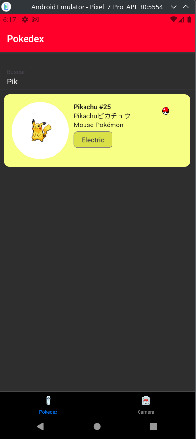
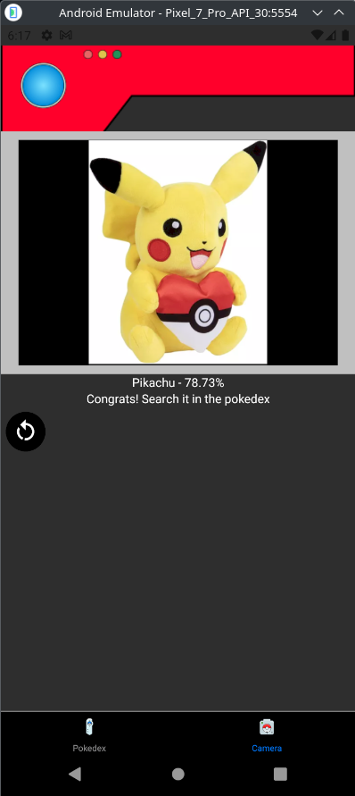
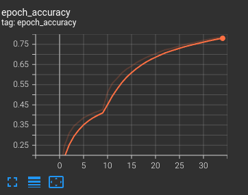
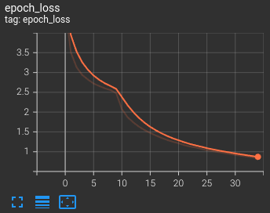

# PokeSnapDex

PokeSnapDex is a React Native application that allows users to identify a Pokemon using a local model (Running on the device, so it works completely offline). Users can either take a picture or select a photo from their device, and the model will identify the Pokémon. If the confidence level is above 60%, you will be able to see a picture and details in the Pokedex tab. (Only 1 Gen)

This project is purely for educational purposes, aiming to learn and apply techniques for creating image classification models. Specifically, the focus is on implementing a TensorFlow Lite (TFLite) model within a React Native application for offline functionality. The goal is to gain practical experience in machine learning model development, deployment on mobile platforms, and enhancing technical skills in these areas.

## Example

 

## Features

- Offline Model: No internet connection required for identifying Pokémon
- Offline data: All the information is stored on a simple .db file located [here](assets/db/database.db)
- Image Capture: Take a picture using your device's camera or select a photo from your gallery.
- Pokedex: View detailed information about the captured Pokémon.

## Install

1. Install dependencies

   ```bash
   npm i
   ```

2. Start the app

   ```bash
    npm start
   ```

3. To work with the model, a development build is needed

- [development build](https://docs.expo.dev/develop/development-builds/introduction/)

## Usage

1. Open the App: Launch PokeSnapDex on your device.
2. Capture/Select Image: Use the camera to take a new picture or select an existing photo from your gallery.
3. Identify Pokémon: The model will process the image and identify the Pokémon if the confidence level is above 60%.
4. View Details: If a Pokémon is identified, you can access to the information on the pokedex tab.

## Model Information

To train the model, I used sprites found on the internet and performed simple web scraping from search engines.

- Base model: MobilenetV2
- Number of Classes: 151
- Epochs: 35

Final accuracy and loss

 
